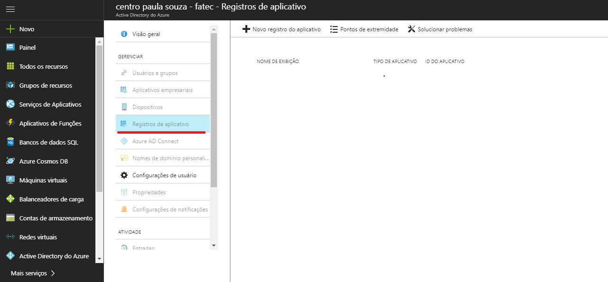

<h1 align="center">Power BI - Filtragem</h1>

  Filtragem de relatórios utilizando a <a href="https://github.com/Microsoft/PowerBI-JavaScript">api</a> javascript do powerbi usando um exemplo de aplicação em c#.

 

  <h3>
    <a href="https://github.com/Microsoft/PowerBI-JavaScript">
      PowerBI - Javascript
    </a>
     | 
    <a href="https://github.com/Microsoft/PowerBI-Developer-Samples">
      PowerBI - Developer Samples
    </a>
     | 
    <a href="https://microsoft.github.io/PowerBI-JavaScript/demo/v2-demo/index.html#">
      Exemplos de interações com relatórios
    </a>
  </h3>

## Tabela de Conteúdo
- [Instalação](#instalação)
- [Registrar aplicativo no Azure](#1-registrar-aplicativo-no-azure)
- [Aplicação demo no visual studio](#2-aplicação-demo-no-visual-studio)
- [Erros comuns](#erros-comuns)
<!-- - [RLS](#rls) -->
<!-- - [Gerar token com JS](#gerar-token-com-javascript) -->

## Instalação

Para utilizar a api é necessário baixar a [aplicação demo](https://github.com/Microsoft/PowerBI-Developer-Samples), registrar um aplicativo usando o [portal de dev do PowerBI](https://dev.powerbi.com/apps), autorizar o aplicativo no [Active Directory do Azure](https://portal.azure.com/#blade/Microsoft_AAD_IAM/ActiveDirectoryMenuBlade), alterar os dados na webconfig do app.

Para realizar as filtragens é alterando o objeto criado  por javascript.

### 1 Registrar aplicativo no Azure

Para utilizar a api é necessário registrar o app no [portal de dev do PowerBI](https://dev.powerbi.com/apps) como native app. É importante depois de registrar o aplicativo, entrar no portal do azure, procurar [Active Directory do Azure](https://portal.azure.com/#blade/Microsoft_AAD_IAM/ActiveDirectoryMenuBlade) e realizar os seguintes passos:

- Clicar em registro de apps

- Clicar em Permissões Necessárias

- Clicar em conceder permissões

### 2 Aplicação demo no visual studio

Baixar a pasta e entrar na pasta **App Owns Data** e abrir o projeto pelo Visual Studio. Altere os dados no arquivo **Web.config**.

* clientId - Id da aplicação do Azure, criada pelo [portal de dev do PowerBI](https://dev.powerbi.com/apps).

* groupId - ID do grupo ou dashboard que você deseja implementar.

* reportId - ID do relatório que você deseja implementar.

* pbiUsername - Admin do grupo escolhido (email)

* pbiPassword - senha do usuário escolhido

Depois é só rodar o projeto (f5), e clicar em report. O relatório deve aparecer.

## Erros Comuns

- Erro de autorização 401: Você nao possui permissão para acessar o relatório. Confirmar se o usuário é administrador do grupo ou se o numero do relatório está correto

- Erro de autorização ao gerar token: As permissões concedidas ao aplicativo não estão certas. Conferir se você criou um native app no azure e se você concedeu as permissões.